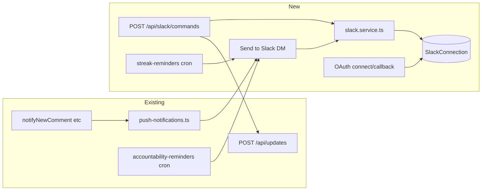

# Slack integration: notifications, post-from-Slack, reminders

## Architecture

- **Mastermind-only:** One Slack workspace; bot token from env (`SLACK_BOT_TOKEN`). No multi-tenant token storage.
- **Identity linking:** New table `SlackConnection` stores which Slack user (team_id + user_id) is linked to which Builders.to user. Linking is done via "Connect Slack" in Settings using Slack OAuth; we only need the installer's `user_id` and `team_id` from the OAuth response.
- **DM delivery:** Notifications and reminders are sent via Web API `conversations.open` + `chat.postMessage` using the env bot token.

---

## 1. Data model and Slack connection flow

**1.1 New table: `SlackConnection`**

- Add in [prisma/schema.prisma](prisma/schema.prisma): `SlackConnection` with `userId` (Builders.to), `slackTeamId`, `slackUserId`, `connectedAt`. Unique on `(slackTeamId, slackUserId)` so one Slack user maps to one Builders.to account. Relation to `User`.
- Run migration.

**1.2 Connect Slack (Settings)**

- **Slack app (manual):** Create app at api.slack.com; add Redirect URL `https://builders.to/api/slack/callback`; OAuth scopes: `chat:write`, `commands` (and `openid`/identity if needed; Slack OAuth v2 returns `authed_user.id` with `chat:write` install). Install app to Mastermind workspace; copy Bot Token to env as `SLACK_BOT_TOKEN`. Also set `SLACK_CLIENT_ID`, `SLACK_CLIENT_SECRET`, `SLACK_SIGNING_SECRET` (for slash command verification).
- **Connect entry:** In [src/components/settings/connected-platforms.tsx](src/components/settings/connected-platforms.tsx), add a "Slack" card (separate from Twitter/LinkedIn if we keep Slack out of `SocialPlatform`). "Connect Slack" links to `GET /api/slack/connect`; "Disconnect" calls `DELETE /api/slack`.
- **GET /api/slack/connect:** Redirect to Slack OAuth v2 (`https://slack.com/oauth/v2/authorize`) with `client_id`, `scope=chat:write,commands`, `redirect_uri`, `state` (CSRF). Store state in cookie.
- **GET /api/slack/callback:** Exchange code for token; from response take `team.id`, `authed_user.id`. Upsert `SlackConnection` for current session user; redirect to `/settings/platforms?success=Slack`.
- **DELETE /api/slack:** Delete `SlackConnection` for current user.
- **GET /api/platforms (or small extension):** Include `slack: { connected: boolean }` by checking for a row in `SlackConnection` for the user so the UI can show Connect/Disconnect.

---

## 2. Feature 1: Send Builders.to notifications to Slack DM

**2.1 Slack client helper**

- New file [src/lib/slack.ts](src/lib/slack.ts) (or `slack.service.ts`):
  - `getSlackConnectionByUserId(userId): Promise<SlackConnection | null>` (query by `userId`).
  - `sendSlackDM(slackUserId: string, text: string, blocks?: Block[]): Promise<boolean>`: use `SLACK_BOT_TOKEN`; call `conversations.open` with `users=slackUserId` to get `channel`; then `chat.postMessage` to that channel. If token missing or API errors, return false and log.
- Keep Block Kit minimal: optional `blocks` for a rich unfurl (e.g. section with title, text, and "View" button linking to `url`).

**2.2 Notify to Slack in addition to push**

- In [src/lib/push-notifications.ts](src/lib/push-notifications.ts):
  - After sending push (or in parallel), if we have a Slack connection for the target user, call `sendSlackDM` with a short message (e.g. same title + body + link).
  - Do this inside `sendUserPushNotification` so every caller (notifyNewComment, notifyLike, notifyNewFollower, notifyProjectUpvote, notifyMilestoneCelebration) gets Slack for free. No changes to API routes.
- Optional: add a small helper `notifyUserSlack(userId, payload)` that builds mrkdwn/block from the same `PushPayload`-like shape and calls `sendSlackDM` for the user’s `SlackConnection.slackUserId`.

---

## 3. Feature 2: Post daily update from Slack

**3.1 Slash command and modal**

- In Slack app config: Slash command `/builders` (or `/builders post`), Request URL `https://builders.to/api/slack/commands`. Optional: global shortcut "Post to Builders.to" with same Request URL.
- New route **POST /api/slack/commands** (or a single **POST /api/slack** that handles both `command` and `payload` for interactivity):
  - **Verification:** Validate request using `SLACK_SIGNING_SECRET` (Slack request signing).
  - **Slash command:** Parse form body `command`, `user_id`, `team_id`, `text`, `response_url`. Look up `SlackConnection` by `(team_id, user_id)`. If none, return 200 with ephemeral JSON: "Connect your Slack in Builders.to Settings first" (with link to settings).
  - **If `text` is non-empty:** Treat as update content. Validate length (e.g. 1–10000 chars). Call shared update-creation logic (see below); then respond with 200 and either ephemeral "Posted! View: [link]" or use `response_url` to post the result.
  - **If `text` is empty:** Return 200 with `response_action: push` to open a modal (Block Kit: single plain_text_input for "What did you ship today?", submit button). Store in modal `private_metadata` the `userId` (or a signed token that encodes userId) so we know who submitted.
  - **Modal submit (view_submission):** Parse `payload` from body (if we use a single endpoint, Slack sends `payload` JSON string). Get content from `view.state.values`. Look up user from `private_metadata`. Call shared update-creation logic; then `ack()` with no errors (or close modal). Optionally post to `response_url` or DM with "Posted!".

**3.2 Shared update-creation logic**

- Extract a **shared service** used by both [src/app/api/updates/route.ts](src/app/api/updates/route.ts) and the Slack handler so streak and karma stay consistent:
  - New function in e.g. [src/lib/services/updates.service.ts](src/lib/services/updates.service.ts): `createDailyUpdateForUser(userId: string, content: string): Promise<{ updateId: string; url: string }>`.
  - Logic: same streak calculation as in [src/app/api/updates/route.ts](src/app/api/updates/route.ts) (lines 169–198), same transaction (create `DailyUpdate` + update `User` streak), then `awardKarmaForUpdate`, `awardKarmaForStreakMilestone`, `autoCheckInFromUpdate`. No polls/images for Slack path.
- **POST /api/updates:** Refactor to call `createDailyUpdateForUser(session.user.id, content.trim())` for the main path after validation (and keep poll/mention handling in the route). Apply daily limit and rate limit in the route as today.

---

## 4. Feature 3: "Time to post" reminders in Slack

**4.1 Accountability reminders (existing cron)**

- In [src/app/api/cron/accountability-reminders/route.ts](src/app/api/cron/accountability-reminders/route.ts):
  - When building the list of users who will receive the email reminder (the same loop that pushes to `emailsToSend`), for each user also check if they have a `SlackConnection`. If yes, add them to a `slackRemindersToSend` list (with user id and reminder copy).
  - After sending emails, iterate `slackRemindersToSend` and call `sendSlackDM(connection.slackUserId, reminderText, optionalBlocks)` with the same CTA as the email (e.g. "Don't forget to check in today" + link). Use `lastAccountabilityReminderSentAt` the same way: only send one reminder per day; after sending Slack reminder, upsert `emailPreferences.lastAccountabilityReminderSentAt` for that user so we don’t send email and Slack twice (or we send both in the same "reminder" concept and update the timestamp once).

**4.2 Streak reminder (new cron)**

- New route **POST /api/cron/streak-reminders** (or name of choice):
  - Auth: same `CRON_SECRET` as other crons.
  - Query: users who have a `SlackConnection`, have not posted a `DailyUpdate` today (no row with `userId` and `createdAt >= startOfToday`). Optionally restrict to users with `currentStreak > 0` or "active in last N days" to avoid spamming new signups.
  - For each: `sendSlackDM` with short message: e.g. "You haven’t posted your daily update yet. Keep your streak: [link to feed/post]."
  - Optional: store `lastStreakReminderSentAt` (e.g. on user or a small prefs table) to avoid sending more than once per day.
- Add this cron to [render.yaml](render.yaml) (or your cron config) to run once per day (e.g. evening).

---

## 5. Environment and config

- **Env vars:** `SLACK_BOT_TOKEN`, `SLACK_CLIENT_ID`, `SLACK_CLIENT_SECRET`, `SLACK_SIGNING_SECRET`. Document in [.env.example](.env.example).
- **Slack app:** Slash command `/builders`; Interactivity Request URL if using modal (can be same as commands URL if you dispatch by `payload` vs `command`). Event Subscriptions not required for slash-only.

---

## 6. Files to add or change (summary)

| Action                | File                                                                                                                                |
| --------------------- | ----------------------------------------------------------------------------------------------------------------------------------- |
| Add model + migration | [prisma/schema.prisma](prisma/schema.prisma)                                                                                        |
| Add                   | `src/lib/slack.ts` – get connection, sendSlackDM                                                                                    |
| Extend                | [src/lib/push-notifications.ts](src/lib/push-notifications.ts) – after push, send to Slack if connected                             |
| Add                   | `src/lib/services/updates.service.ts` – createDailyUpdateForUser                                                                    |
| Refactor              | [src/app/api/updates/route.ts](src/app/api/updates/route.ts) – use createDailyUpdateForUser                                         |
| Add                   | `src/app/api/slack/connect/route.ts`, `src/app/api/slack/callback/route.ts`, `src/app/api/slack/route.ts` (GET connection, DELETE)  |
| Add                   | `src/app/api/slack/commands/route.ts` – slash command + modal submit                                                                |
| Extend                | [src/app/api/cron/accountability-reminders/route.ts](src/app/api/cron/accountability-reminders/route.ts) – add Slack DMs            |
| Add                   | `src/app/api/cron/streak-reminders/route.ts`                                                                                        |
| Extend                | [src/components/settings/connected-platforms.tsx](src/components/settings/connected-platforms.tsx) – Slack card, connect/disconnect |
| Extend                | [src/app/api/platforms/route.ts](src/app/api/platforms/route.ts) – include slack.connected                                          |
| Extend                | [.env.example](.env.example) – Slack vars                                                                                           |
| Optional              | [render.yaml](render.yaml) – streak-reminders cron job                                                                              |

---

## 7. Order of implementation

1. Prisma model + migration; env example.
2. `src/lib/slack.ts` (SlackConnection lookup, sendSlackDM).
3. Connect flow: connect/callback + DELETE + platforms list + Settings UI.
4. Notifications: extend push-notifications.ts to send to Slack.
5. Updates service: extract createDailyUpdateForUser; refactor POST /api/updates.
6. Slash command + modal: POST /api/slack/commands with verification and createDailyUpdateForUser.
7. Accountability cron: add Slack branch and lastAccountabilityReminderSentAt behavior.
8. Streak-reminders cron and render.yaml.

This keeps dependencies in order and allows testing connect and notifications before slash commands and crons.